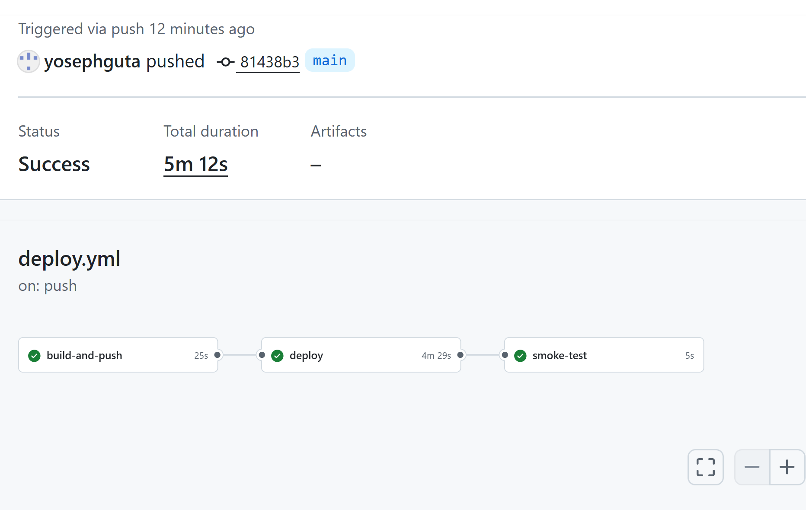
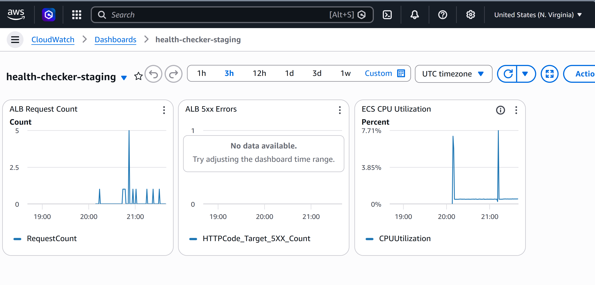

# Health Checker

## Project Overview

Health Checker is a small production-style service that checks the availability of URLs and returns their status, response time, and HTTP status code. The API exposes endpoints for checking a single URL or a batch of URLs asynchronously.

The goal of the project is not just the API itself, but the **complete DevOps lifecycle around it**: containerization, infrastructure-as-code, automated CI/CD, and deployment to AWS ECS behind a load balancer.

This repository demonstrates how a simple application can be built and deployed using **modern cloud-native practices**.

---

# Architecture Diagram

```
                GitHub
                   │
                   │ Push / PR
                   ▼
          GitHub Actions CI Pipeline
           ├─ Run Tests (pytest)
           ├─ Build Docker Image
           └─ Push Image to ECR
                   │
                   ▼
                Amazon ECR
             (Docker Registry)
                   │
                   ▼
            Amazon ECS (Fargate)
           ┌───────────────────┐
           │   FastAPI App     │
           │  Health Checker   │
           └───────────────────┘
                   │
                   ▼
        Application Load Balancer
                   │
                   ▼
                Internet
                   │
                   ▼
                Clients

Logs → CloudWatch Logs  
Metrics → CloudWatch
```

Infrastructure is provisioned using **Terraform modules**:

```
Terraform
│
├─ networking module
│    ├─ VPC
│    ├─ Subnets
│    ├─ Internet Gateway
│    └─ Security Groups
│
├─ ecr module
│    └─ Docker image repository
│
└─ ecs module
     ├─ ECS Cluster
     ├─ ECS Service
     ├─ Task Definition
     └─ Application Load Balancer
```

---

# Tech Stack

**Python + FastAPI**
High-performance async API framework. Chosen for simplicity and excellent async support.

**httpx**
Async HTTP client used to perform URL health checks concurrently.

**Docker**
Containerizes the application to ensure consistent runtime across environments.

**AWS ECS (Fargate)**
Serverless container orchestration. Chosen to run containers without managing EC2 instances.

**Amazon ECR**
Private Docker registry used to store application images.

**Terraform**
Infrastructure as Code. All AWS infrastructure is reproducible and version-controlled.

**GitHub Actions**
CI/CD pipeline that automatically tests, builds, and deploys the application.

**CloudWatch Logs & Metrics**
Used for monitoring container logs and observing service health.

---

# Pipeline Flow

The CI/CD pipeline automatically moves code from commit to deployment.



### 1. Pull Request

When a PR is opened to `main`:

CI pipeline runs:

1. Checkout repository
2. Install Python dependencies
3. Run unit tests with `pytest`
4. Build the Docker image

If any step fails, the pipeline stops.

---

### 2. Merge to Main

When code is merged to `main`, the deploy pipeline runs:

1. Build Docker image
2. Tag image with commit SHA
3. Push image to Amazon ECR
4. Download the current ECS task definition
5. Inject the new image tag
6. Deploy new revision to ECS
7. Wait for ECS service stability
8. Run smoke test against `/health` endpoint

This ensures only **tested and buildable code** is deployed.

---

# Local Development

Live staging environment:
http://health-checker-staging-alb-189381685.us-east-1.elb.amazonaws.com/docs

Run the project locally using Docker Compose.

```
docker compose build
docker compose up
```

API will be available at:

```
http://localhost:8000/docs
```

Example request:

```
POST /check

{
  "url": "https://google.com"
}
```

---

# Infrastructure

Infrastructure is managed with Terraform modules.

### Initialize Terraform

```
cd terraform/environments/staging
terraform init
```

### Plan Infrastructure

```
terraform plan
```

### Apply Infrastructure

```
terraform apply
```

Terraform provisions:

* VPC
* Public subnets
* Security groups
* Internet gateway
* ECS cluster
* ECS service
* Application Load Balancer
* ECR repository
* CloudWatch log group

---

# Monitoring



Application logs are sent to **CloudWatch Logs** from the ECS container.

Typical log group:

```
/ecs/health-checker-staging
```

Metrics to monitor:

* **5xx error rate** (ALB)
* **Target health status**
* **Task restarts**
* **Response times**

CloudWatch dashboard example:

```
https://console.aws.amazon.com/cloudwatch/
```

Key indicators of issues:

* High ALB 5xx errors
* Unhealthy ECS targets
* Frequent container restarts

---

# Key Engineering Decisions

### 1. ECS Fargate instead of EC2

Fargate eliminates the need to manage servers. This keeps the infrastructure simple and focuses the project on application deployment and automation.

---

### 2. Separate Terraform Modules

Infrastructure is split into three modules:

* networking
* ecr
* ecs

This separation keeps infrastructure reusable and prevents tightly coupled resources.

---

### 3. Image Tagging with Git Commit SHA

Docker images are tagged using:

```
sha-${commit}
```

Benefits:

* Immutable deployments
* Easy rollback
* Clear mapping between code and runtime image

---

### 4. Health Endpoint + Smoke Test

The pipeline runs a smoke test against `/health` after deployment.

This verifies:

* ECS tasks started correctly
* ALB routing works
* The application is actually serving traffic

If the smoke test fails, the deployment pipeline fails immediately.

---

# Future Improvements

* Add HTTPS with ACM certificates
* Deploy production environment with approval gates
* Add autoscaling for ECS service
* Add structured logging and distributed tracing
* Implement rate limiting

---

# Author
yosephguta

Built as a **DevOps portfolio project** demonstrating:

* containerized microservices
* infrastructure as code
* automated CI/CD
* production-style cloud deployment
